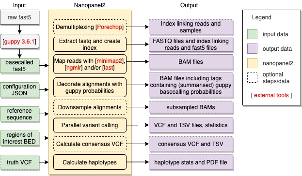

::

    .=============================================.
                                             _ 
    ._ _  ___ ._ _  ___  ___  ___ ._ _  ___ | |
    | ' |<_> || ' |/ . \| . \<_> || ' |/ ._>| |
    |_|_|<___||_|_|\___/|  _/<___||_|_|\___.|_| 2
                        |_|                    
    .=============================================.
    

Introduction
============

Nanopanel2 (np2) is a somatic variant caller for Nanopore panel sequencing data.
Np2 works directly on basecalled FAST5 files and outputs VCF v4.2 and TSV files containing 
variant calls and associated statistics. It also produces haplotype map TSV and PDF files that 
inform about haplotype distributions of called (PASS) variants.

A preprint describing and evaluating the Nanopanel2 software is available at `bioarxiv.org`_.

.. _bioarxiv.org: https://doi.org/10.1101/2020.11.06.370858 

Installation
============

The recommended way to use np2 is via the released `Singularity`_ v3.4.1 images which contains all 
required 3rd party tools in the supported software versions. Nanopanel2 SIF files can be found in the
`releases`_ sections.

.. _Singularity: https://sylabs.io/docs/
.. _releases: https://github.com/popitsch/nanopanel2/releases/

Users that prefer to run the python code directly should make sure that the following
3rd party tools are available:

3rd Party tools
---------------
The following 3rd party executables are called by the np2 python pipeline and are packaged in the singularity container:

* `samtools`_ v1.9
* `porechop`_ v0.2.4
* `minimap2`_ v2.17
* `ngmlr`_ v0.2.7
* `last`_ v1042
* bgzip v1.2.1++

Note that the call path of the respective tools can be configured in np2's JSON config file 
(section 'exe') which makes it possible to install these tools locally.

.. _samtools: https://github.com/samtools/samtools
.. _porechop: https://github.com/rrwick/Porechop
.. _minimap2: https://github.com/lh3/minimap2/
.. _ngmlr: https://github.com/philres/ngmlr
.. _last: http://last.cbrc.jp/

Input data
==========
To run np2, you need the following input data files:

* Guppy-basecalled FAST5 files [required]
* FASTA file containing all considered amplicon sequences [required]

Additionally, you can provide a truth-set VCF file per sample if you want to measure the performance of np2 on your data.

Np2 supports multiplexed input data and can be configured to automatically run porechop for demultiplexing before any further processing is done.
Note that you do not need to configure all of your multiplexed samples in case you want to process only a subset of them. Np2 will ignore the 
other samples in this case.  

Guppy preprocessing
-------------------

Np2 input FAST5 files must contain `guppy`_ basecalling information. Np2 was developed and tested with guppy v3.6.1, an example commanline to call guppy is: 

::

   guppy_basecaller \
        -i fast5_file \
        -s output_dir \
        -c dna_r9.4.1_450bps_hac.cfg \
        --hp_correct on \
        --fast5_out \
        --trace_categories_logs Move \
        --num_callers 14 \
        --gpu_runners_per_device 8 \
        --chunks_per_runner 768 \
        --chunk_size 500 \
        --disable_pings \
        --compress_fastq \
        -x auto

.. _guppy: https://community.nanoporetech.com/protocols/Guppy-protocol/v/GPB_2003_v1_revT_14Dec2018

Configuration file
------------------

Np2 is fully configured via a single JSON configuration file, `a commented example`_ can be found in the docs folder.
Please note that np2 uses the `commentjson`_ package to parse input JSON files, so you can use Python/JavaScript style inline comments.
 
.. include:: docs/config.json.example

.. _`a commented example`: docs/config.json.example
.. _commentjson: https://github.com/vaidik/commentjson

General usage
=============

::

   singularity run nanopanel2_XXX.sif call --conf config.json --out .

Runtime and memory requirements strongly depend on the size of input data and the number of configured threads.
We recommend to run np2 with at least 64gb RAM, larger flowcells may require 128gb.
The number of used CPU cores/threads (we recommend at least 8) is configurable via 
the 'threads' parameter in the JSON config file. 

Np2 now runs the whole processing pipeline (see block diagram above) and produces result files
along the way. If np2 fails at some stage you can typically restart it and it continues the pipeline
from the stage that failed. 

License
=======

Nanopanel2 is free for academic use.
   
If you want to use Nanopanel2 for commercial applications but don't want to adhere to the GNU Affero General Public License v3.0, you can purchase a commercial license. 
Please contact the author in this case.   
   
Copyright (c) 2020 Niko Popitsch.

Detailed license information can be found in the `LICENSE`_ file.

This distribution may include materials developed by third parties.
For license and attribution notices for these materials, please refer to the LICENSE file.
  
.. _`LICENSE`: LICENSE

Citation
========

If you make use of nanopanel2, please cite our preprint:

    Nanopanel2 calls phased low-frequency variants in Nanopore panel sequencing data.
    Niko Popitsch, Sandra Preuner and Thomas Lion.
    bioRxiv 2020.11.06.370858; doi: https://doi.org/10.1101/2020.11.06.370858
 